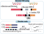

# `yasim_sctcr` -- Yet Another SIMulator for Single-Cell T-Cell Receptor Sequencing (scTCR-Seq)

**Markdown compatibility guide** This file is written in [Myst-flavored Markdown](https://myst-parser.readthedocs.io/), and may show errors on the default landing page of PYPI or Git Hostings. You can correctly preview it on generated Sphinx documentation or [Visual Studio Code](https://code.visualstudio.com) with [ExecutableBookProject.myst-highlight](https://marketplace.visualstudio.com/items?itemName=ExecutableBookProject.myst-highlight) plugin.

---

## Introduction

Single-Cel T-Cell Receptor (TCR) Sequencing (scTCR-Seq) is an important method in studying the diversity and dynamics of T-cell populations in organisms. However, since the number of publically available scTCR-Seq datasets are limited, researchers often needs to reconstruct TCR contigs from scRNA-Seq data, and a benchmark of such tools is required.

This software provides an easy way to simulate Next-Generation Sequencing (NGS)-based scTCR-Seq using Illumina sequencer simulator. With realistic TCR contig constructed from statistics of **1.08 million** human TCR V/J CDR3 sequences from [hUARdb](https://huarc.net), it supports simulation of TCR contigs from arbitrary cell number, sequencing depth, read length with Paired/Single End support. It also supports mixing scTCR-Seq data with simulated scRNA-Seq data, which allows calculation of both precision and sensitivity.



## Installation

### Using the Pre-Built Version from PYPI

You need a working [Python](https://www.python.org) interpreter (CPython implementation) >= 3.7 (**recommended 3.8**) and the latest [`pip`](https://pip.pypa.io/) to install this software from [PYPI](https://pypi.org). Command:

```shell
pip install yasim-sctcr==0.1.0
```

You are recommended to use this application inside a virtual environment like [`venv`](https://docs.python.org/3/library/venv.html), [`virtualenv`](https://virtualenv.pypa.io), [`pipenv`](https://pipenv.pypa.io), [`conda`](https://conda.io), or [`poetry`](https://python-poetry.org).

### Build from Source

Before building from the source, get a copy of the latest source code from <https://github.com/WanluLiuLab/yasim> using [Git](https://git-scm.com):

```shell
git clone https://github.com/WanluLiuLab/yasim-sctcr
```

Or, if you prefer to use [GNU Wget](https://www.gnu.org/software/wget).

```shell
wget -o yasim-master.zip https://github.com/WanluLiuLab/yasim-sctcr/archive/refs/heads/master.zip
unzip yasim-master.zip
```

You need Python interpreter (CPython implementation) >= 3.7, latest PYPA [`build`](https://pypa-build.readthedocs.io), and [`setuptools`](https://setuptools.pypa.io/) to build this software. You are recommended to build the software in a virtual environment provided by [`virtualenv`](https://virtualenv.pypa.io), etc.

Build and install the simulator using:

```shell
cd yasim-sctcr
python3 -m build
pip install dist/yasim-sctcr-0.1.0-py3-none-any.whl
```

Apart from the above instructions, you should also install [ART](https://www.niehs.nih.gov/research/resources/software/biostatistics/art/index.cfm) which is a general-purpose NGS DNA-Seq simulator and is available from [Conda](https://anaconda.org/bioconda/art) and [APT](https://packages.debian.org/stable/art-nextgen-simulation-tools). Tested versions are `2.5.8 (June 6, 2016)`.

## News

The initial release version is [0.1.0](https://pypi.org/project/yasim-sctcr/0.1.0/) at 2023/08/06.

- 0.1.1: Addressed several problems proposed by the reviewers:
  - [X] Simulation for TRC gene added to `generate_tcr_cache` and `rearrange_tcr`.
  - [ ] Support the simulation of non-productive TCRs on a fixed ratio.
  - [ ] The scRNA-Seq simulator accepts scDesign3 outputs.
  - [X] Supported the distribution of TCR repertoire created by clonal expansion.
  - [ ] scTCR-Seq-specific fragment length and bias.
  - [X] Supported V/J usage bias.
